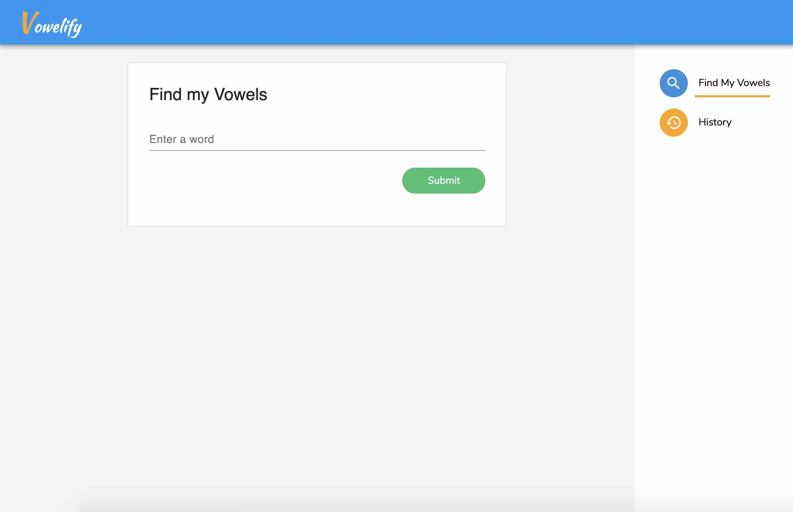
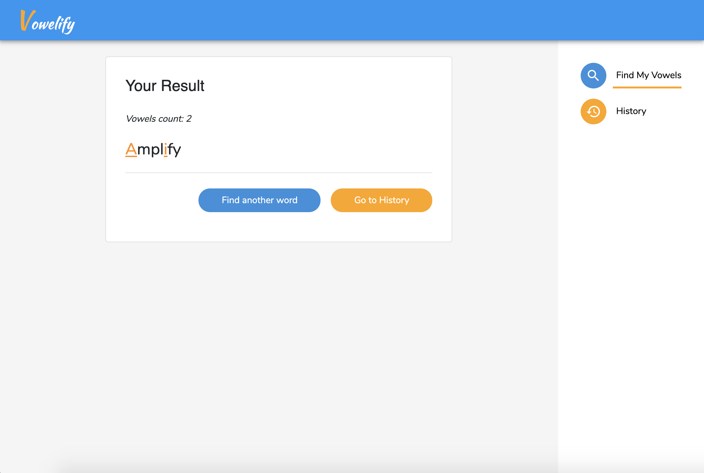
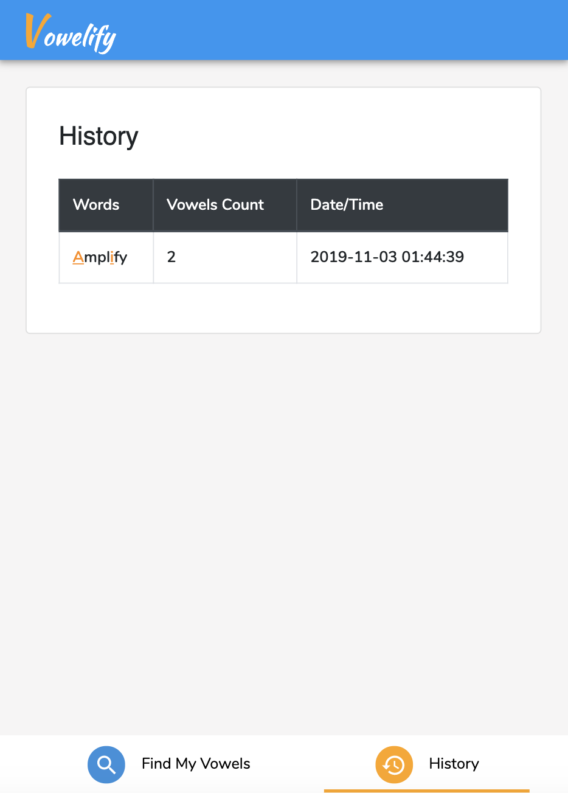

# Vowelify App

An app for calculating vowels inside a word.

---

## UI

- PC View




- iPad & Mobile View



---
## Dependencies

### Front-end
- ReactJS
- React Material UI
- Bootstrap

### Back-end
- Laravel (>= PHP 7.1)
- MySQL

---
## Preparation

- In order to run this project, you first need to install PHP version >=7.1 and Composer (a dependencies manager for PHP).

- To install Composer, please follow the link attached: https://getcomposer.org/download/

- Then, you will need to set an alias to run composer globally:
```
alias composer='/usr/local/bin/composer.phar'
```

- You may need a MySQL server in your localhost, ideally XAMPP or AMPPS or WAMPP.

---

## Installation

### Step 1:
Install Laravel dependencies:
```
composer install
```

Run the environment setup:

```
npm run setup-env
```

### Step 2: 
Configue your database:

Please go to the .env file in the root folder, and change these following settings to your localhost MySQL configurations:

```
DB_DATABASE=
DB_USERNAME=
DB_PASSWORD=
```

Then, run the database setup:

```
npm run setup-db
```

## Run

Run this command and your app will be ready at `localhost:8000`

```
php artisan serve
```


### Notes:
- The View is located at `./resources` folder.

- And the Controller is located at `./app/Http/Controllers/FindVowelsController.php`.


